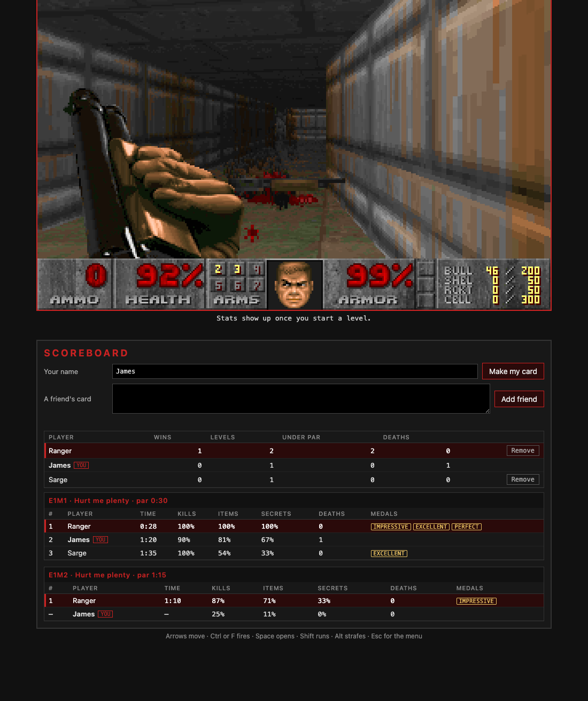

# doom

Doom, shareware episode one, as an Embabel realm.

The game runs as Wasm inside the realm's browser app. While you play, the realm keeps your
sessions and levels in its own SQLite and puts them in the graph. You can ask your assistant how
a run went, query your history in Virtual Cypher, and trade score cards with friends to see who
is fastest on each level.



## Contents

- [Install](#install)
- [Play](#play)
- [Ask your assistant](#ask-your-assistant)
- [Playing against friends](#playing-against-friends)
- [Your runs in the graph](#your-runs-in-the-graph)
- [Handlers](#handlers)
- [What's in here](#whats-in-here)
- [What the appliance needs](#what-the-appliance-needs)
- [Tests](#tests)
- [Rebuilding the engine](#rebuilding-the-engine)
- [Changing the realm](#changing-the-realm)
- [Licences](#licences)

## Install

1. In the appliance's console, open the Realm Store and install `doom`.
2. Admit the realm's handlers when the appliance asks. A realm's code runs only after its owner
   admits it.
3. Approve the app `doom.html`. An app needs its own approval, separate from the handlers.
4. Open the app at `/apps/doom/doom.html`.

To work on the realm from a checkout, clone this repo into the folder your appliance mounts for
local realms and install it from that path.

The appliance has to allow Wasm realms and carry the SQLite module. See
[What the appliance needs](#what-the-appliance-needs).

## Play

Click the screen, then press Enter to start.

| Key | What it does |
|---|---|
| Arrow keys | Move and turn |
| Ctrl or F | Fire |
| Space | Open doors, press switches |
| Shift | Run |
| Alt | Strafe |
| 1 to 7 | Pick a weapon |
| Esc | Menu |
| Tab | Map |

The game takes keys only while the screen has focus, so typing in the scoreboard never moves the
player. The engine has no sound.

Under the screen, a strip shows the level, your time, kills, items, secrets, health, armor and
weapon. The line below it says what the realm saved. The app sends the realm a snapshot every few
seconds, and an event when a level starts, when you finish one and when you die.

## Ask your assistant

The realm adds one goal, `recap-my-doom`. Ask in chat:

> How did my last Doom run go?

The assistant gets your latest session level by level: time against par, kills, items, hidden
areas, each death, and where you stand against friends on the levels you have both finished.

`tests/questions.yml` lists the questions the realm is meant to answer, and the ones it can't.
It keeps no positions, no per-monster kills and no players beyond the friends whose cards you
added.

## Playing against friends

The app's sandbox has no network, so stats travel as a card. A card is a code that starts with
`DOOM1-`. It holds a player's name and their best run of every level.

1. Scroll to Scoreboard under the game.
2. Type your name and press **Make my card**. Press **Copy** and send the code to a friend any
   way you like.
3. Paste a friend's code into **A friend's card** and press **Add friend**.

The scoreboard then shows who leads overall and one board per level and skill, fastest first.

- A newer card from the same player replaces the older one.
- You can keep up to 32 friends. **Remove** takes one off.
- Your own row is live. A friend's row is as fresh as the last card they sent.
- A refused card says why: it lost characters in the copy, it isn't a card, or it is your own.

### How a best is worked out

A player's best on a level is their fastest finished run at that skill. Its kills, items and
hidden areas are the counts from that same run. A level you have started and never finished shows
no time and takes the counts of your latest run. Deaths count every run of the level.

### Medals

| Medal | You get it for |
|---|---|
| Impressive | Finishing at or under par |
| Excellent | Killing every monster |
| Perfect | Every kill, every item and every hidden area |

A win is a level where you hold first place and someone else has finished it too.

### What a card can and can't be trusted for

Cards are not signed, and nothing checks that a card is honest. They are for playing against
people you know. A card that reuses a friend's id replaces that friend's entry.

Everything in a card is checked before it is stored: the code's checksum, every number's range,
the map names, and the name, which can't carry hidden or direction-changing characters. A card
holds at most 64 bests and 12,000 characters.

## Your runs in the graph

The realm puts four kinds of node in the graph, all reached from your user.

```
(:AssistantUser)-[:PLAYED_DOOM]->(:DoomSession)-[:HAS_LEVEL]->(:DoomLevel)
(:AssistantUser)-[:KNOWS_DOOM_PLAYER]->(:DoomPlayer)-[:HAS_BEST]->(:DoomBest)
```

| Label | What it is | Properties |
|---|---|---|
| `DoomSession` | One sitting, from opening the app to closing it | `sessionId`, `startedAt`, `lastPlayedAt`, `skill`, `skillName`, `lastMap`, `health`, `armor`, `weapon`, `ammo`, `levelsPlayed`, `levelsCompleted`, `kills`, `totalKills`, `killPercent`, `items`, `itemPercent`, `hiddenAreas`, `hiddenAreaPercent`, `deaths`, `playSeconds` |
| `DoomLevel` | One run of one level | `levelId`, `sessionId`, `map`, `episode`, `mapNumber`, `attempt`, `skill`, `skillName`, `startedAt`, `completed`, `completedAt`, `timeSeconds`, `parSeconds`, `underPar`, `kills`, `totalKills`, `killPercent`, `items`, `totalItems`, `itemPercent`, `hiddenAreas`, `totalHiddenAreas`, `hiddenAreaPercent`, `deaths` |
| `DoomPlayer` | You, or a friend whose card you added | `playerId`, `name`, `isOwner`, `cardDate`, `wins`, `levelsFinished`, `levelsUnderPar`, `deaths` |
| `DoomBest` | One player's best on one level and skill | `bestId`, `playerId`, `playerName`, `map`, `skill`, `skillName`, `rank`, `finished`, `bestSeconds`, `parSeconds`, `underPar`, `killPercent`, `itemPercent`, `hiddenAreaPercent`, `deaths`, `runs`, `awards` |

Doom's secrets are called hidden areas in the graph, because the host drops any property whose
name looks like a secret.

Filters on `DoomSession.skillName`, `DoomLevel.map` and `DoomBest.map` with `=` or `IN` are pushed
down to the realm, which applies them before it returns rows.

The levels you finished under par:

```cypher
MATCH (u:AssistantUser)-[:PLAYED_DOOM]->(s:DoomSession)-[:HAS_LEVEL]->(l:DoomLevel)
WHERE l.underPar
RETURN l.map, l.skillName, l.timeSeconds, l.parSeconds
ORDER BY l.map
```

Who is fastest on E1M1:

```cypher
MATCH (u:AssistantUser)-[:KNOWS_DOOM_PLAYER]->(p:DoomPlayer)-[:HAS_BEST]->(b:DoomBest)
WHERE b.map = 'E1M1' AND b.finished
RETURN p.name, b.skillName, b.bestSeconds, b.awards
ORDER BY b.bestSeconds
```

The overall standings:

```cypher
MATCH (u:AssistantUser)-[:KNOWS_DOOM_PLAYER]->(p:DoomPlayer)
RETURN p.name, p.wins, p.levelsFinished, p.levelsUnderPar, p.deaths
ORDER BY p.wins DESC
```

## Handlers

| Handler | Called by | What it does |
|---|---|---|
| `doom.welcome` | the app | The line shown above the game. |
| `doom.record` | the app | Saves one game event: a snapshot, a level starting, a level finished or a death. |
| `doom.shareCard` | the app | Makes your card. The first call fixes your player id. |
| `doom.importCard` | the app | Adds a friend's card, or replaces the one held for that player. |
| `doom.removeFriend` | the app | Takes a friend off the scoreboard. |
| `doom.scoreboard` | the app | The standings and one board per level. |
| `doom.sessions` | the graph | Rows for `DoomSession`. |
| `doom.levels` | the graph | Rows for `DoomLevel`. |
| `doom.players` | the graph | Rows for `DoomPlayer`. |
| `doom.bests` | the graph | Rows for `DoomBest`. |
| `doom.recap` | the `recap-my-doom` goal | Your latest session in plain words, for the assistant. |

The host never shows an app the message of a handler that threw. So `shareCard`, `importCard` and
`removeFriend` answer `{ "refused": "<why>" }` when the player's input is at fault, and the app
shows that text. They throw only when something else went wrong.

## What's in here

| Path | What it is |
|---|---|
| `realm.ts` | The realm: the handlers, the four producers, the recap goal, the SQLite dependency and the app. |
| `realm.yml`, `producers/`, `goals/`, `types/`, `dist/`, `dependencies/`, `apps/doom.html.app.json` | What the appliance installs. Written by synth from `realm.ts`. Don't edit by hand. |
| `wasm/handlers.ts` | The handlers. |
| `db/schema.sql` | The tables behind sessions and levels. Frozen: see [Changing the realm](#changing-the-realm). |
| `apps/doom.html` | The page: the screen, the stats strip, the scoreboard and the key hints. |
| `apps/doom.html.assets/app.js`, `app.css` | The app code and styles. |
| `apps/doom.html.assets/engine.js` | The engine, Wasm inlined. Written by `build.sh`. |
| `apps/doom.html.assets/wad.js` | The shareware `DOOM1.WAD` as base64. |
| `engine/doomgeneric_realm.c` | The engine's platform layer: frames out to the page, keys in, and `dg_stats`. |
| `engine/srcs.txt` | The engine sources that get compiled. |
| `build.sh` | Clones the engine at a pinned commit and compiles it with Emscripten. |
| `tests/handlers.test.ts` | Unit tests for recording, the session and level producers and the recap. |
| `tests/cards.test.ts` | Unit tests for cards, the scoreboard and the player and best producers. |
| `tests/schema.test.ts` | Pins `db/schema.sql` to the bytes installed realms hold. |
| `tests/questions.yml` | The questions people ask in chat, and the ones the realm can't answer. |
| `hints/tips.yml` | The tips the host shows while the realm is installed. |
| `icon.svg` | The realm's icon. |
| `docs/app.png` | The screenshot above. |

## What the appliance needs

- Wasm realms switched on: `ASSISTANT_REALMLOADER_ADMISSIONENABLED=true`.
- The `sqlite3-wasi` 3.53 module in the appliance's Wasm dependency store
  (sha256 `9a5542e25e42fbbb48501bae0ab4295cdf0fd0f41219ec3b6c891c4a282e7779`).
- Nothing else. The app's page and assets come to about 6 MB, inside the appliance's default
  10 MiB limit for a realm browser app. The realm calls no outside API and needs no key.

## Tests

```bash
bun test tests
```

The tests run the real handlers against an in-memory SQLite that stands in for the host's. They
cover recording, paging, pushed-down filters, the recap, the card round trip, every refusal, the
ranking and the medals. They need [Bun](https://bun.sh) and nothing else.

Things only a running appliance shows are not covered by them: the app's approval, the sandbox,
and the graph. After a change, install the realm in an appliance, play a level, add a card and
run the queries above.

## Rebuilding the engine

```bash
./build.sh
```

Needs git and Emscripten. It clones [doomgeneric](https://github.com/ozkl/doomgeneric) at commit
`dcb7a8dbc7a16ce3dda29382ac9aae9d77d21284` into `vendor/`, adds `engine/doomgeneric_realm.c` and
writes `apps/doom.html.assets/engine.js`.

The committed `engine.js` was built with Emscripten 6.0.10, and `build.sh` reproduces it byte for
byte with that version. Another version can produce different bytes.

## Changing the realm

`realm.ts` is the source of truth. After changing it, the handlers or the app, run the Embabel
realm synth over `realm.ts` to rewrite the installable files at the repo root.

Leave `db/schema.sql` exactly as it is. The host ties a realm's saved database to that file's
hash, so an edited file locks players out of the history they already have. A table the realm
needs later is made by the handlers with `CREATE TABLE IF NOT EXISTS`, the way
`ensureFriendTables` does. `tests/schema.test.ts` fails if the file changes.

Three rules of the host shape the code:

- A handler's thrown message never reaches the app. Anything the player should read comes back as
  a result.
- A producer answers `{ rows, next }` only when it declares a page. Without one, it answers a
  bare list.
- An argument the host passes to a producer's handler, such as a cursor or a pushed-down filter,
  has to be listed in that handler's input schema.

## Licences

- **The engine** is the Doom source as released by id Software, through doomgeneric, under the
  GNU General Public License version 2 or later. `engine/doomgeneric_realm.c` is under the same
  licence. The full text is in [LICENSE](LICENSE). `engine.js` is built from exactly the sources
  `build.sh` names, so that script and the pinned commit are the corresponding source.
- **The realm's own code** (`realm.ts`, `wasm/`, `db/`, the app's `app.js`, `app.css` and
  `doom.html`, and `icon.svg`) is under the same GPL, because the app runs as one program with
  the engine.
- **`DOOM1.WAD`** is id Software's shareware game data, version 1.9, unmodified
  (sha1 `5b2e249b9c5133ec987b3ea77596381dc0d6bc1d`). It is not GPL. id Software allows the
  shareware version to be passed on free of charge, and it stays their copyright. The registered
  and retail WADs are not redistributable and are not here.

Doom is a trademark of id Software. This realm is not affiliated with or endorsed by them.
